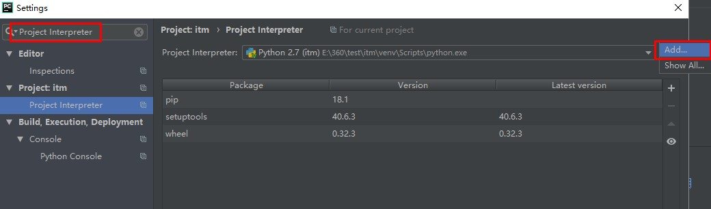
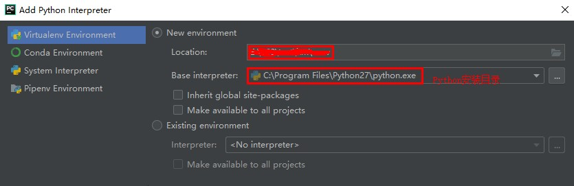
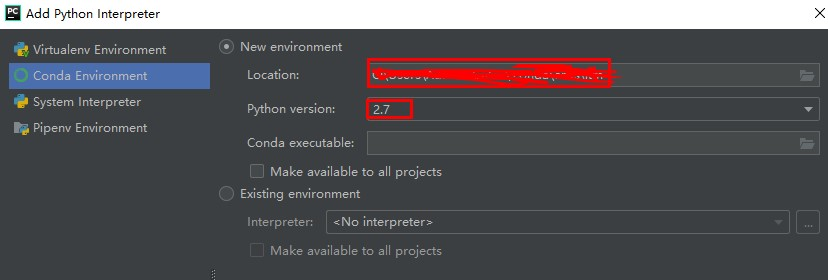
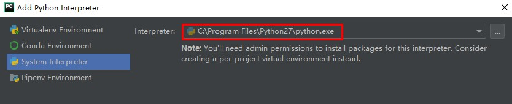
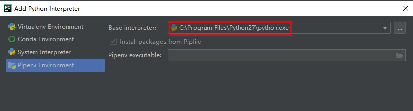

# itm

集成测试脚本工具

<!-- toc -->
## 目录

- [简介](#简介)
- [下载/运行 说明](#下载运行-说明)
- [使用说明](#目录说明)
<!-- tocstop -->

### 简介

1. 实现测试过程代码化，避免重复而繁琐的手工测试
2. 利用Python解释型语言的特性，实现测试代码可以灵活多变，自由组合测试过程
3. 针对具体项目，整理常用的测试公共接口，减少代码中重复逻辑

### 下载运行-说明

1. python安装
    * 版本要求：Python 2.7
    * 下载地址：https://www.python.org/downloads/release/python-2715/
    
2. python IDE
    * 推荐：PyCharm Community
    * 下载地址：https://www.jetbrains.com/pycharm/download/

3. 配置python IDE的虚拟环境(venv)，以PyCharm为例
    * File >> Settings >> Project Interpreter

     
     
     
     
     
     
     
     
     
    

